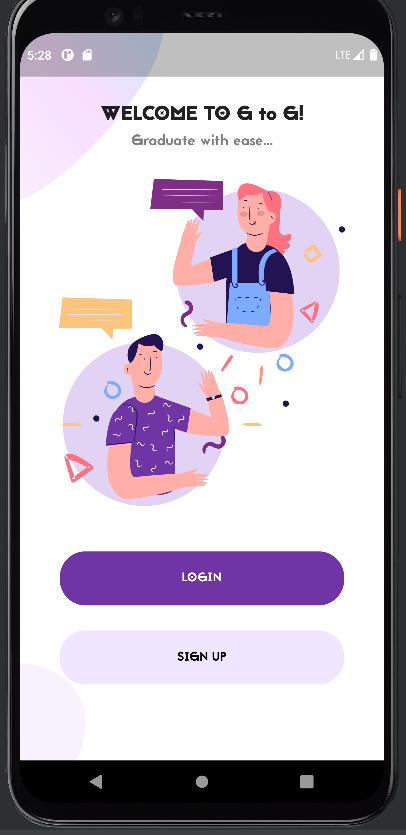

# G-TO-G: A GRADUATION MOBILE APPLICATION FOR BOTH iOS AND ANDROID
## KWAME NKRUMAH UNIVERSITY OF SCIENCE AND TECHNOLOGY,
## COLLEGE OF SCIENCE, 
## DEPARTMENT OF COMPUTER SCIENCE
### PRESENTATION BY AYITEY EBENEZER
### SUPERVISED BY DR. ERIC OSEI

## RESEARCH TOPIC AND PROJECT IDEA

IT Category: Mobile Application Dev’t

Language : Dart (Google)

Framework : Flutter

IDE : Android Studio

### ABSTRACT

### TITLE OF PROJECT

G-to-G: Graduands to Graduates

Pertains to the automation a student (graduand) goes to through before he/she becomes a  graduate.

Graduand: a person who is about to receive an academic degree.

Graduate: a person who has successfully completed a course of study especially a person who has been awarded an undergraduate or first academic degree.

### INTRODUCTION

By looking around my surroundings and trying to identify gaps, I found a manual solution to a problem that can be automated to eradicate some problems associated with graduation making it more effective and efficient. The problem I identified and seek to solve is that of making the graduation process more feasible and less stressful. This can be done by automating the most of the graduating experience and making it less cumbersome and stressful for graduands.

### PROBLEM STATEMENT

 ● Extension of scheduled days for apparel collection causes a wastage of university resources such as money and time
 
 ● Difficulty, on the side of students, to find photo studios or photographers to commemorate their graduation day
 
 ● Students missing deadlines associated with item collection which leads to them paying extra charges to attain those products

### LITERATURE REVIEW

### AIM OF PROJECT

The aim of this project is basically to reduce the stress factor for students and University staff as a whole. By scheduling everything, close to perfection, for each graduating class and by inserting a personal calendar-alarm functionality to alert them of all occasions, students are aware of all procedures to be taken care of in order to graduate successfully. This will help save money, time and use of human as well as personnel resources.

### OBJECTIVES

 ● Payment of money to the school -for graduation apparel such as gowns- which will be later rescinded to the student after safely returning items taken from the school. 
 
 ● Implementation of customized Graduation Apparel at a fee. (Personal Preference) 
 
 ● Scheduler functionality to keep track of all procedures to be undergone before becoming a graduate. This uses an alarm kind of service 
 
 ● Implementation of Token or QR Code for verification, confirmation and collection of Item package. 
 
 ● Purchase of photoshoot ticket from accredited KNUST approved photoshoot studios. 

### METHODOLOGY

A hybrid methodology was used in this project. The waterfall and agile methodologies needed to be combined in order to achieve optimal productivity and efficiency. There was an idea of what the end product should look like but it was subject to some changes and experimentation. This required the project to have some structure but also be flexible hence the hybrid methodology being best suited for the project.

The Agile methodology is a way to manage a project by breaking it up into several phases.
Waterfall methodology is a sequential development process that flows like a waterfall through all phases of a project (analysis, design, development, and testing, for example), with each phase completely wrapping up before the next phase begins.

The UI elements were built from tools provided by the Flutter Software Development Kit (SDK).
Cloud Firestore was used  as the back-end database.
Cloud Firestore is a noSQL database which means it does not follow any schema. However the data had to be modeled after a schema in order to keep this organized.

### FLOWCHART

### RESULTS & UI DESIGN

### IMPLEMENTATION

 ● Students can pay for items such as photoshoot ticket, gown collection online
 
 ● Students can book and buy photoshoot ticket online
 
 ● Students can set personal reminders
 
 ● Students can personalize some part of their profile
 
 ● Students can view graduation details such as location, date, seat allocation, etc.
 
 ● Students can view results

 ● Students can send text messages to each other

 ● Students can access the transwift portal for transcript ordering

### CONCLUSION

 ● The categories of people who would benefit from this project would be Graduands from KNUST and the school as a whole since it eradicates the wastage of resource in the form of extension for item collection and money for the upkeep of those programs.

 ● Allows time to be used efficiently by students through reminder functionality

 ● Seeks to ease the discomfort associated with graduating from  the university
 
 ● Due to automation of most manual processes, wastage of human and personnel resources is limited
